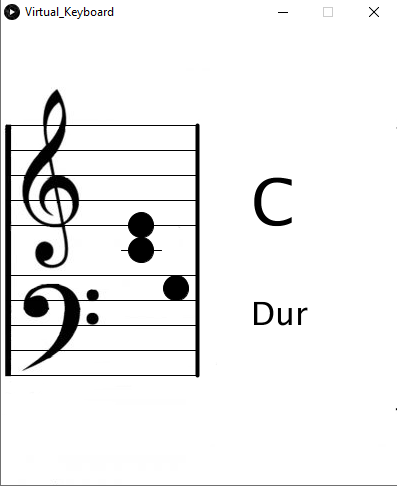

# Virtual Keyboard
## Introduction
Using a Midi Keyboard and want to see your notes in a score?  
Want to know the chord you are playing?  
  
This short program provides you with both.  
Playing with your keyboard got a lot easier. 

## User Interface
Below is the User Interface depicted.
On the left, the current notes are shown, on the right the current chord.

## Installation
You need Processing to run this script.
Processing is an graphical library and IDE built for art and visual design.  
Download it here: https://processing.org/download/ 

## Running
If you have installed Processing, you can simply run the script Virtual_Keyboard.
If your Midi-Keyboard is connected correctly and recognized by your PC,
everything should run instantly.  
Press some keys and begin playing.

If a red error is printed, that your keyboard is not found, than your keyboard is not registered correctly.
Check the print out in the console, find your keyboard name in the input rows.
The number in front of your keyboard must be the same as in line 9 of the script.

## Using a Midi-Splitter
If you want to use a DAW or similiar software simultaneously, you may want to use a Midi-Splitter like Loop-Midi with MIDI-OX.  
Download here: https://www.tobias-erichsen.de/software/loopmidi.html and http://www.midiox.com/.  
Create two virtual Midi-Ports with Loop-Midi, one for your DAW and one for the script.
Use MIDI-OX to split the incoming Midi-Data.
Use the right port in your DAW and change the MIDI Device in this script.

